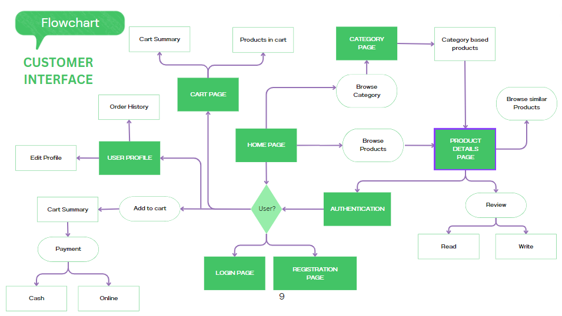
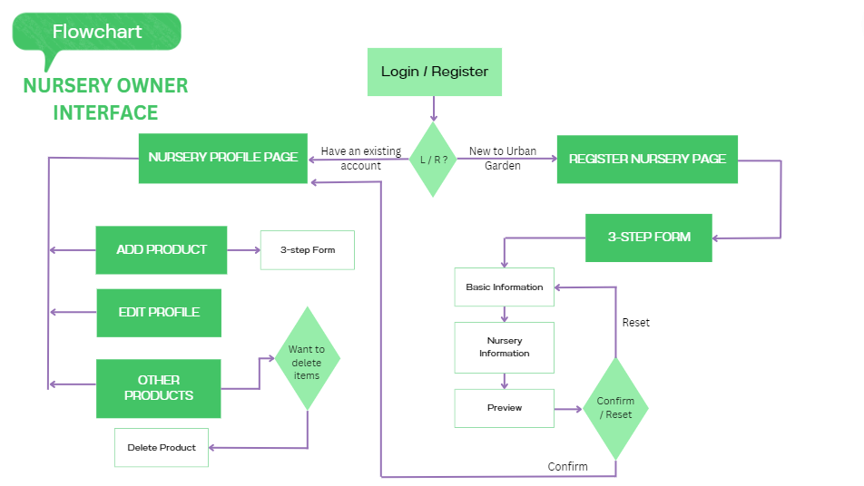
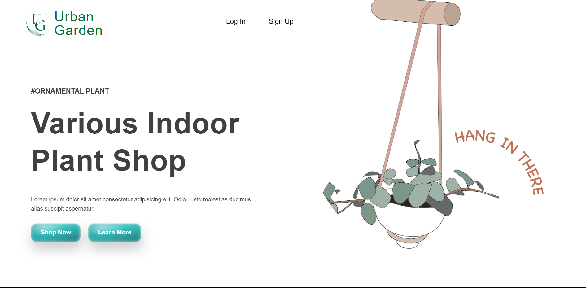
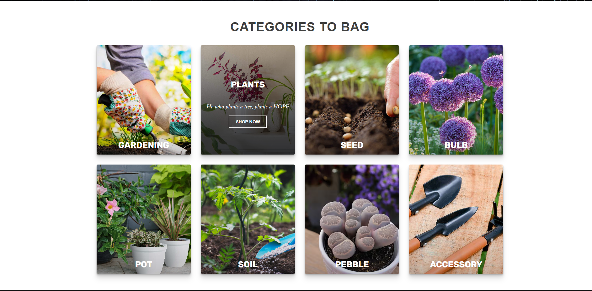
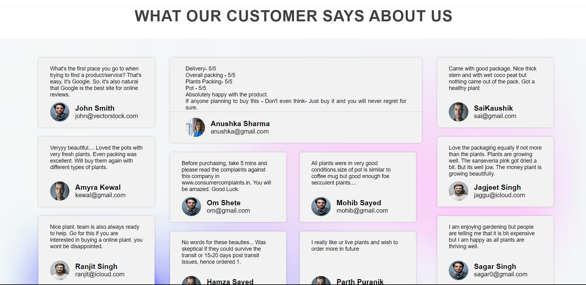
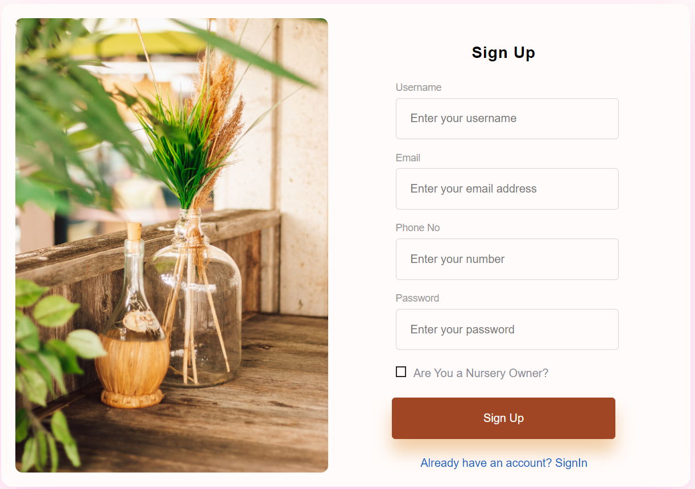
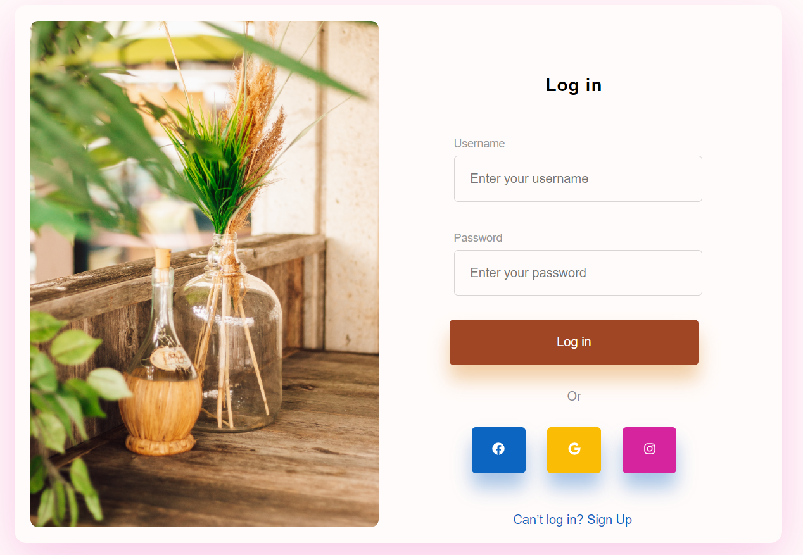
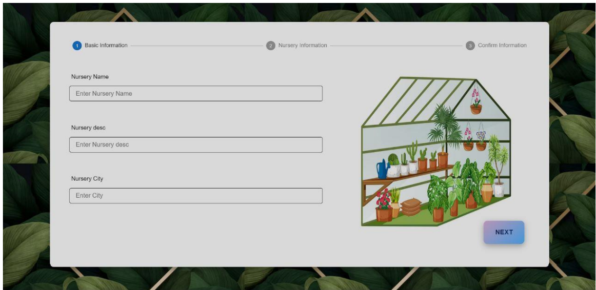
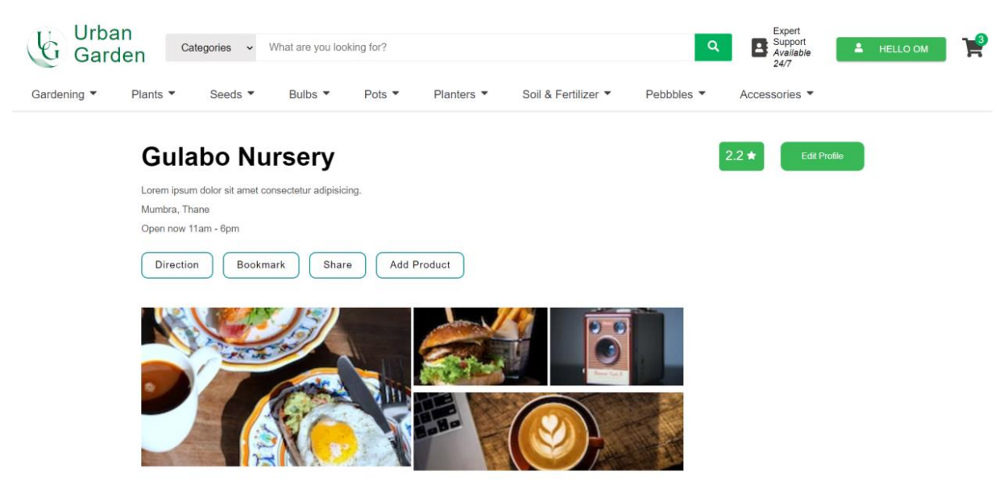
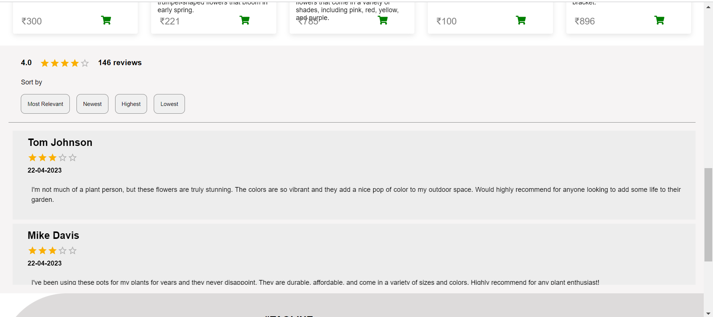

# UrbanGarden

<br/>

<p align="center">
  
</p>

<p align="center">
  Experience the joy of gardening with Urban Garden - where nature meets technology for a seamless shopping experience!
  <br />
  <br />
  <a href="#table-of-contents"><b>Explore the docs »</b></a>
  <br />
  <br />
  <a href="#architecture-and-design">Architecture</a>
  &nbsp;&nbsp;·&nbsp;&nbsp;
  <a href="#demonstration">Features</a>
  &nbsp;&nbsp;·&nbsp;&nbsp;
  <a href="#contributing">Local Setup</a>
  <br />
</p>

https://github.com/omshete0550/UrbanGarden/assets/95119784/bfdc75c3-e1cd-4898-ab3e-308ff115cd1c

## Table Of Contents

- [About the Project](#about-the-project)
- [Architecture](#architecture)
<!-- - [Demonstration & Features](#demonstration) -->
- [Technologies Used](#technologies-used)
- [Contributing](#contributing)
<!-- - [License](#license) -->
- [Authors](#authors)

## About The Project

We offer a wide range of standout features to maintain the convenience to our customers. The Setup Nursery feature, which allows nursery owners to create and customize their own online nursery store. Customers can browse through a vast selection of plants, seeds, and gardening supplies, view information and place an order

Objectives:

- To offer a wide selection of high-quality gardening products and accessories at competitive prices.
- To offer a secure & reliable platform for online transactions, ensuring that customer information are protected.
- To establish long-term relationships with nursery partners to ensure a reliable and consistent supply of high-quality products.
- To provide a seamless and user-friendly shopping experience for customers.
- To expand the reach of the gardening community by making gardening products and resources accessible to people in urban areas.

## Architecture

The architecture and workflow was built using smartdraw.


<br />


<!-- ## Demonstration

<br />

**Landing Page**

<p align="left">
  
  
  
</p>

<br />
<br />

**Register & Login**
<br />

<table>
    <tr>
        <td>
            
        </td>
        <td>
            
        </td>
    </tr>
    <tr>
        <td>
          <p>User Registration.</p>
        </td>
        <td>
          <p>User Login to start the shopping.</p>
        </td>
    </tr>
</table>

<br />

**Nursery Registration Page**

<p align="left">
  
</p>

<br />
<br />

**Home Page**

<p align="left">
  
  
</p>

<br />
<br />

**Nursery Page**

<p align="left">
  
  
</p>

<br />

**Add To Cart Page**

<p align="left">
  
</p>

<br />

**Filters Page**

<p align="left">
  
</p>

<br />

**Single Product Page**

<p align="left">
  
  
</p>

<br /> -->

<br />

### Technologies Used

- Workflow and Architecture Design
  - SmartDraw
- Frontend
  - React.js
  - CSS
- Backend
  - Node.js (Express.js)
  - MongoDB

<br />

## Contributing

**Local Setup || Project Structure**

NOTE: Individual instructions can be found in respective directories.

- The project contains 4 broad directories.

```
*
├───client
└───server
```

- `client`: The frontend for the application.
- `server`: The backend for the application.

<br />

**Client**

For local setup of frontend:

- `cd client`
- `npm i`
- `npm start`
- Go to `localhost:3000`

Structure

```
src
├───assets
├───Components
├───hooks
├───redux
├───Pages
├───App.js
└───index.js
```

Individual Component & Pages Structure

```
component
├───component.jsx
└───component.css
```

```
Pages
├───page.jsx
└───page.css
```

<br />
<br />

**Server**

For local setup of backend:

- `cd server`
- `npm i`
- `npm start`

```
server
├───controllers
├───models
├───routes
├───utils
├───index.js
└───package.json
```

<br />
<br />

## Authors

- Om Shete
  - [LinkedIn](https://www.linkedin.com/in/om-shete-25748522a/)
- Mohib Abbas Sayed
  - [LinkedIn](https://www.linkedin.com/in/mohib-abbas-sayed-83837422a/?utm_source=share&utm_campaign=share_via&utm_content=profile&utm_medium=android_app)
- Hamza Sayyed
  - [LinkedIn](https://shorturl.at/hjAEI)
