# UrbanGarden
UrbanGarden is an innovative **e-commerce platform** that aims to revolutionize the way people buy and grow plants. The platform focuses on providing a seamless and convenient experience for urban dwellers who want to create their own garden at home, regardless of the size of their living space. We provide a platform to all the nursery vendors to register their nurseries on our platform and expand their businesses.
 
 
There are two interfaces:
- **Nursery Vendor** (can act as a buyer): Can register the nursery and add/delete nursery items
- **Buyer**: Can purchase items from multiple nurseries
 
 

## Tech Stack

  
  
  
  
  

 

  
Frontend: REACTJS, REDUX

  
Backend: NODEJS, EXPRESSJS

  
Database: MONGO DB

 

## ETC - Estimated Time to Complete
Duration: 2 months
  

## Block Diagrams

  <h3># CUSTOMER INTERFACE</h3>
  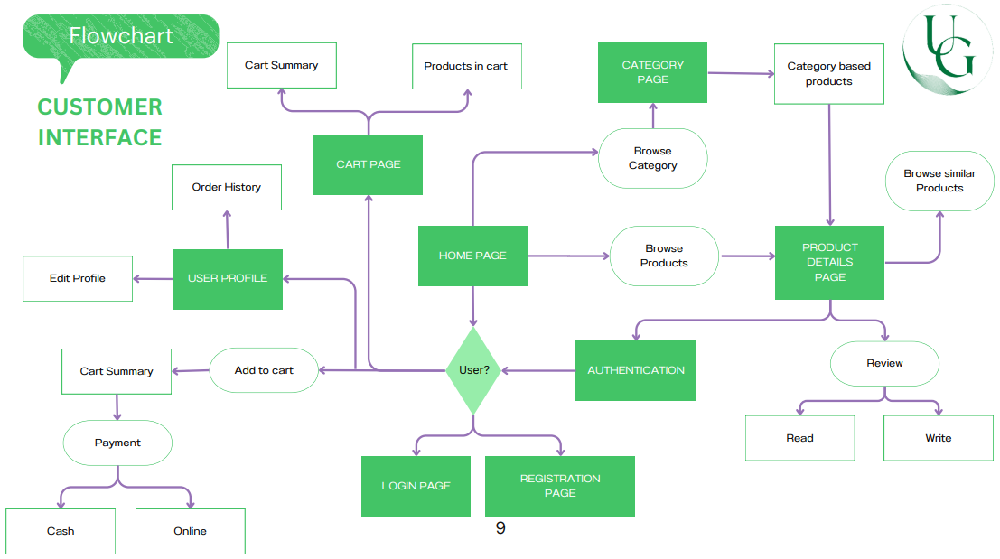

 

  <h3># NURSERY VENDOR INTERFACE</h3>
  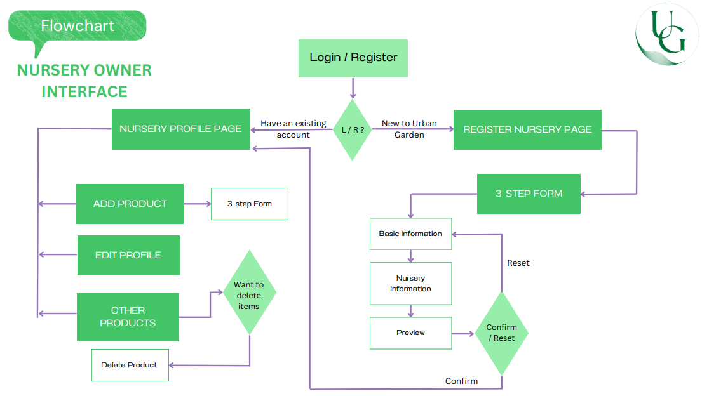

  

## Snapshots
# Landing Page

  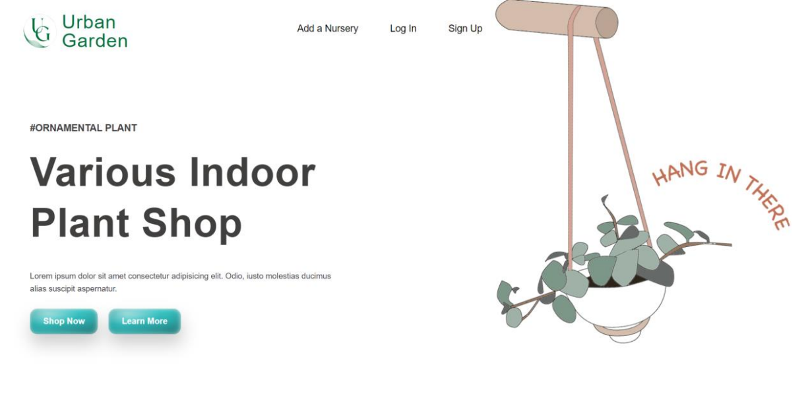 
  <i>Fig: Landing Page 1.1</i>
   
   
  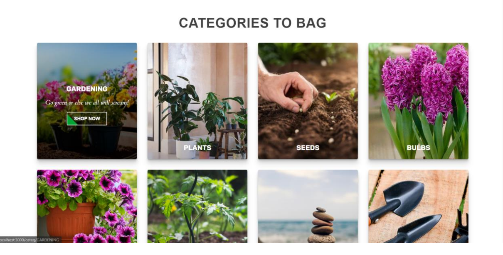 
  <i>Fig: Landing Page 1.2</i>
   

  

# Login Page

  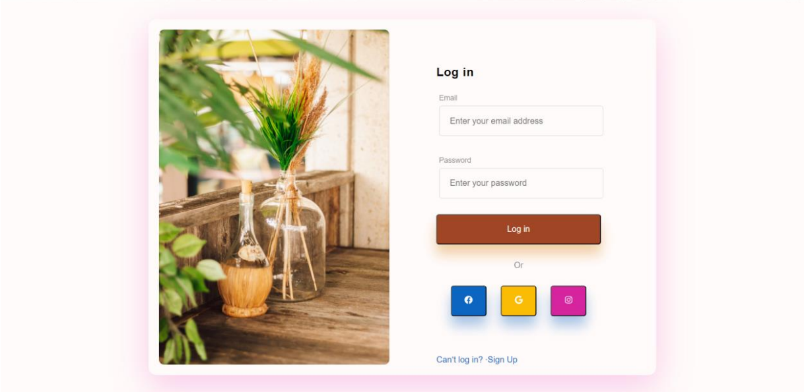 
  <i>Fig: Login Page 1.1</i>
   
   
  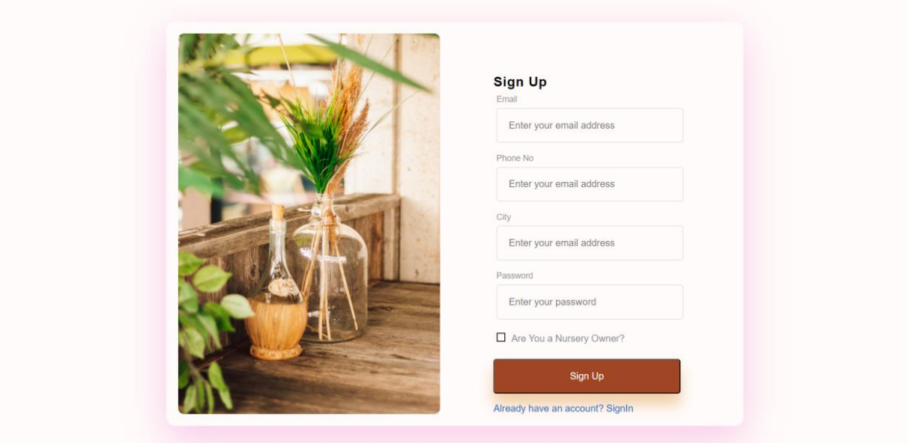 
  <i>Fig: Login Page 1.2</i>
   

  

# Home Page

  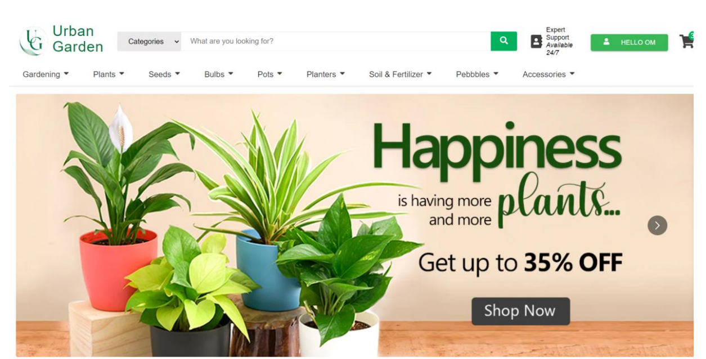 
  <i>Fig: Home Page 1.1</i>
   
   
  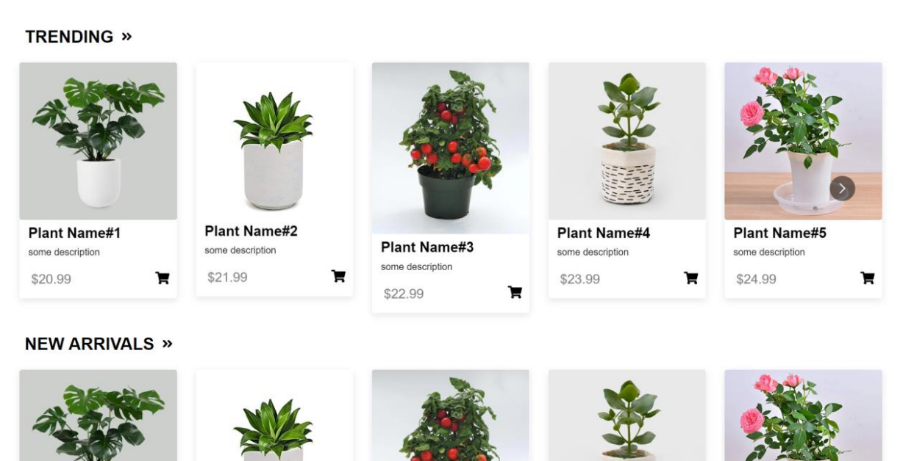 
  <i>Fig: Home Page 1.2</i>
   
   
   
  <i>Fig: Home Page 1.2</i>
   

  

# Single Category Page

  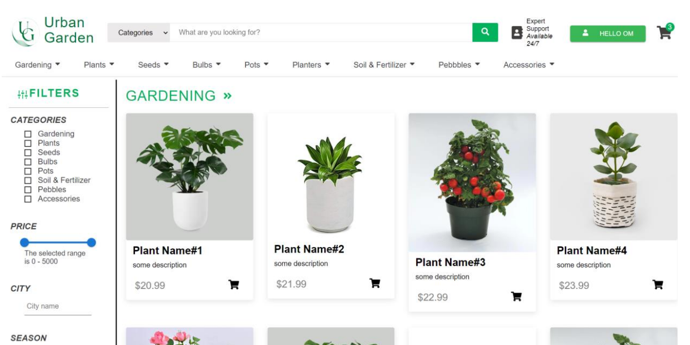 
  <i>Fig: Single Category Page 1.1</i>
   

  

# Single Product Page

  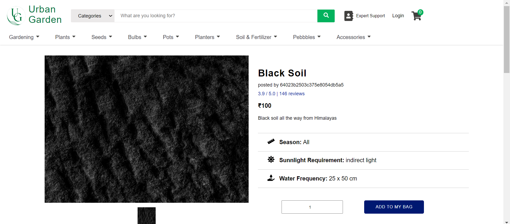 
  <i>Fig: Single Product Page 1.1</i>
   
   
   
  <i>Fig: Single Product Page 1.2</i>
   

  

# Nursery Profile Page

   
  <i>Fig: Nursery Profile Page 1.1</i>
   
   
   
  <i>Fig: Nursery Profile Page 1.2</i>
   

  

# Add to Cart Page

  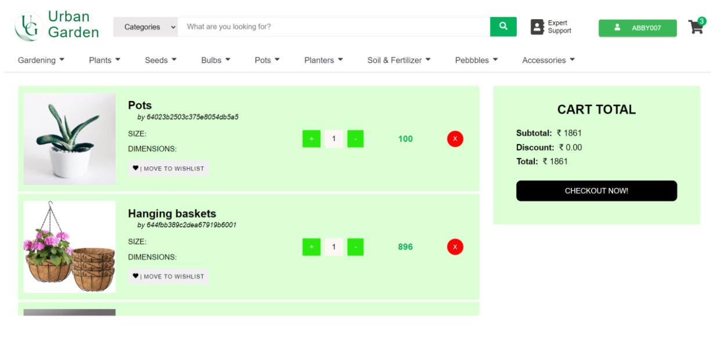 
  <i>Fig: Add to Cart Page 1.1</i>
   

  

# Add Nursery Items Page

   
  <i>Fig: Add Nursery Items Page 1.1</i>
   

  

